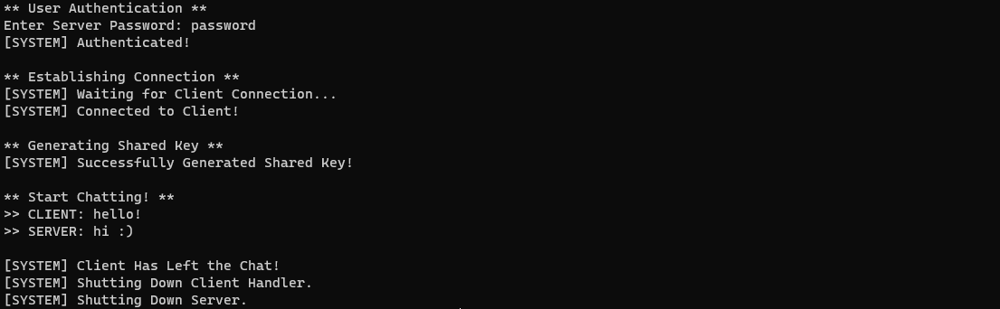
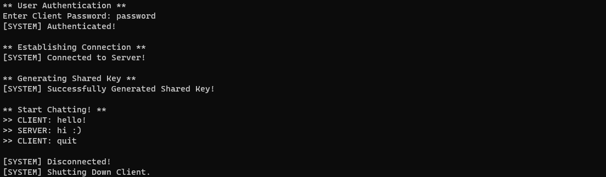

SecureChat is a chatting application using socket programming that incorporates secure communication between the Server and Client.
1. Authentication: This program implements a simple password-based authentication mechanism.
    - Users are required to enter a password, which is then compared with a stored hashed password file to verify their identity.
    - AuthenticationTool Class provides methods for password validation and authentication. The SHA-256 hashing algorithm is used to hash the entered password for secure comparison. If the entered password matches the stored hashed password, the authentication is considered successful. The use of SHA-256 enhances password security.
    - TO-DO: Implement password salting for even more secure protection.

2. Integrity: This program includes an integrity verification mechanism that ensures the integrity of a message using a hash function.
    - When a message is sent, the sender computes a hash of the message using SHA-256 and appends the computed hash (separated by '|') to the end of the message. When a message is received, the receiver extracts the main message and the received hash value. The main message is hashed using SHA-256 and compared to the received hash value. If they match, it indicates that the message has not been tampered with during transmission, and the integrity of the message is considered valid.
    - IntegrityTool Class provides methods for verifying the integrity of a message. 

3.  Confidentiality: This program utilizes the Diffie-Hellman Key Exchange Algorithm to securely exchange keys and establish a shared secret key.
    - Before establishing connection, the Server and Client agrees on a shared secret key, which is then used with AES to encrypt and decrypt messages.
    - ConfidentialityTool Class provides methods for generating key pairs, exchanging keys, and extracting the shared secret key.
    - All messages are encrypted and decrypted, so that the content of the messages remains confidential from unauthorized access.

Server Terminal:

Client Terminal:

